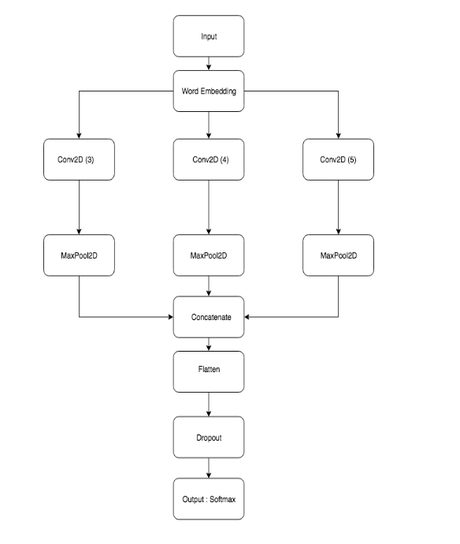

# Contents
1. Text Classification using different models
2. NNI for TextCNN

## What is Text Classification?

Text Classification is one of the most valuable tasks of Natural language processing and is used to solve many problems. Instead of sorting out the categories manually from textual data, we can use text classification to solve this problem, which reduces time! 
#### Examples of Text Classification:
**Sentiment Analysis** "The food was excellent! - Positive"
**Language Detection** "The food was excellent! - English-en"
and more.

**Text Classification** is a process that provides labels to the set of texts or words in one, zero, or predefined label format. These labels tell us about the sentiment of the text.
There may be different models through which we can train our machines to understand human languages. A machine can not directly understand the inputted data in the form of text; we need to transform this data and can do this in various ways:
1. Corpus in NLP: count the occurrence of each word in the sentence and provide it for the entire text.
2. CountVectorizer: make a vocabulary where every word has its special index number. 

Input:
    
    from sklearn.feature_extraction.text import CountVectorizer
    examplevectorizer = CountVectorizer()
    examplevectorizer.fit(example)
    examplevectorizer.vocabulary_ 

Output:

     {'The': 0,
      'food': 1,
      'was': 2,
      'excellent': 3,
    } 
    
This resulting vector is called a feature vector. Each word has its category in the feature vector, which is in numeric terms.
The data is prepared to fit in the model.There can be different models that can be used to fit the textual data, and in this article, Linear Regression, Naive Bayes, TextCNN, and RNN have been used to compare the models. 
As Yoon Kim gave his paper, the main focus remains on TextCNN and its variants.

##### Introduction to CNN 
Convolutional Neural Network is just a kind of neural network that performs well in image classification and computer vision. Its convolutional layer differs from other neural networks. We will be dealing with CNN for Text Classification.
Back in the 2014, [Yoon Kim](https://aclanthology.org/D14-1181) devised a very simple Convolutional Neural Network for Sentence Classification as a foundation for text classification and tried different variants of it to compare the performance. The main model focussed in this article will revolve around this architecture given by Yoon Kim.

The image above shows the CNN structure used by Yoon Kim, which is the basic CNN structure used for text classification. We consider text data as sequential data like data in time series, a one-dimensional matrix. We need to work with a one-dimensional convolution layer. The model idea is almost the same, but the data type and dimension of convolution layers changed. To work with TextCNN, we require a word embedding layer and a one-dimensional convolutional network. 

**What is Word Embedding?**
Word embedding represents the density of the word vector, which maps semantically similar words. It is a different way to preprocess the data. It does not consider the text as a human language but maps the structure of sets of words used in the corpus. They aim to map words into a geometric space which is called an embedding space.
The most common words do not have an extensive index in the embedding space.

One problem is the different lengths of words for which we need to specify the length of the word sequence and provide max length parameters to solve it. We need to use pad_sequence(), which pads the
sequence of words with zeros. Once the padding is done, we have to append zero value to matrices and now apply the deep learning model. This is how word embedding makes relations between words. In the next step, we will try to fit the TextCNN model.

We use a predefined word embedding available from the library for better performance. If the data is not embedded, then many embeddings are available open-source, like Glove and Word2Vec.
When we do dot product of vectors representing text, which turns zero if they belong to the same class, but if we do dot products of embedded words, we can find interrelation of words for a specific class. The kernel(filter layer) is passed over these embeddings to find convolutions, and the Max Pooling Layer of CNN dimensionally reduces these.
Lastly, the fully connected layers and the output activation function will give values for each class.
##### The Code:
**Dataset Used.**
The dataset used to test the models is Movie Review Dataset. (MR Dataset). In this dataset, the phrases are given and their corresponding sentiments.
**Yoon Kim code implementations and results:**
The architecture Kim uses is:
1. Sentences are represented as vectors of words.
2. These words are converted into (300D) vectors giving us a 2D representation for each sentence.

Approaches for creating these word vectors:
1. CNN-rand:(the basic model) where embeddings are randomly assigned to each word
2. CNN-static: word2vec is used to provide word embeddings. Unknown words are randomly initialized. These embeddings are kept fixed.
3. CNN-non-static: as above, but the vectors are fine-tuned (i.e., they can be changed) during training.
4. CNN-multichannel: Two sets of word vectors are used. Fine-tuning is done.
Convolutions are performed on these 2D representations with different window sizes (3, 4, and 5) are performed on the representations directly and then max pooled. Then the final predictions are made!

The accuracies for some of the datasets are are shown
 Model & MR & SST1 &SST2 \\
 CNN-rand & 73.1 & 45.0 & 82.7\\ 
 CNN-static & 81.0 & 45.5 & 86.8\\ 
 CNN-non-static & 81.5 & 48.0 & 87.2 \\ 
 CNN-multichannel & 81.1 & 47.4 & 88.1\\ 

For instance a perceptron could get 3 different inputs as in the image, lets pretend that the inputs it receives as signal are: $x_1 = 1, \; x_2 = 2\; and \; x_3 = 3$, if it's weights are $w_1 = 0.5,\; w_2 = 1\; and \; w_3 = -1$ respectively, then what the perceptron will do when the signal is received is to multiply each input value by its corresponding weight, then add them up.

\( 
\begin{align}
\begin{split}
\left(x_1 * w_1\right) + \left(x_2 * w_2\right) + \left(x_3 * w_3\right)
\end{split}
\end{align}
\)

\( 
\begin{align} 
\begin{split} 
\left(0.5 * 1\right) + \left(1 * 2\right) + \left(-1 * 3\right) = 0.5 + 2 - 3 = -0.5
\end{split} 
\end{align} 
\)

Typically when this value is obtained, we need to apply an "activation" function to smooth the output, but let's say that our activation function is linear, meaning that we keep the value as it is, then that's it, that is the output of the perceptron, -0.5.

In a practical application, the output means something, perhaps we want our perceptron to classify a set of data and if the perceptron outputs a negative number, then we know the data is of type A, and if it is a positive number then it is of type B.

Once we understand this, the magic starts to happen through a process called backpropagation, where we "educate" our tiny one neuron brain to have it learn how to do its job.

<tweet>The magic starts to happen through a process called backpropagation, where we "educate" our tiny one neuron brain to have it learn how to do its job.</tweet>

For this we need a set of data that it is already classified, we call this a training set. This data has inputs and their corresponding correct output. So we can tell the little brain when it misses in its prediction, and by doing so, we also adjust the weights a bit in the direction where we know the perceptron committed the mistake hoping that after many iterations like this the weights will be so that most of the predictions will be correct.

After the model trains successfully we can have it classify data it has never seen before, and we have a fairly high confidence that it will do so correctly.

The math behind this magical property of the perceptron is called gradient descent, and is just a bit of differential calculus that helps us convert the error the brain is having into tiny nudges of value of the weights towards their optimum. [This video series by 3 blue 1 brown explains it wonderfuly.](https://www.youtube.com/watch?v=aircAruvnKk&list=PLZHQObOWTQDNU6R1_67000Dx_ZCJB-3pi)

My program creates a single neuron neural network tuned to guess if a point is above or below a randomly generated line and generates a visualization based on graphs to see how the neural network is learning through time.

The neuron has 3 inputs and weights to calculate its output:
    
    input 1 is the X coordinate of the point,
    Input 2 is the y coordinate of the point,
    Input 3 is the bias and it is always 1

    Input 3 or the bias is required for lines that do not cross the origin (0,0)

The Perceptron starts with weights all set to zero and learns by using 1,000 random points per each iteration.

The output of the perceptron is calculated with the following activation function:
    if x * weight_x + y weight_y + weight_bias is positive then 1 else 0

The error for each point is calculated as the expected outcome of the perceptron minus the real outcome therefore there are only 3 possible error values:

|Expected  |  Calculated | Error|
|:----:|:----:|:----:|
|1|-1|1|
|1|1|0|
|-1|-1|0|
|-1|1|-1|

With every point that is learned if the error is not 0 the weights are adjusted according to:

    New_weight = Old_weight + error * input * learning_rate
    for example: New_weight_x = Old_weight_x + error * x * learning rate

A very useful parameter in all of neural networks is teh learning rate, which is basically a measure on how tiny our nudge to the weights is going to be. 

In this particular case, I coded the learning_rate to decrease with every iteration as follows:

    learning_rate = 0.01 / (iteration + 1)

this is important to ensure that once the weights are nearing the optimal values the adjustment in each iteration is subsequently more subtle.

In the end, the perceptron always converges into a solution and finds with great precision the line we are looking for.

Perceptrons are quite a revelation in that they can resolve equations by learning, however they are very limited. By their nature they can only resolve linear equations, so their problem space is quite narrow. 

Nowadays the neural networks consist of combinations of many perceptrons, in many layers, and other types of "neurons", like convolution, recurrent, etc. increasing significantly the types of problems they solve.
